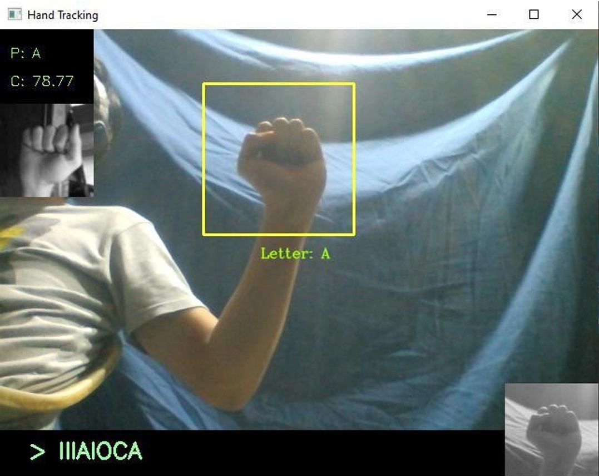

#American Sign Language Alphabet Recognition using CNN

A project that uses a convolutional neural network for recognizing American Sign Language Alphabet.
The system utilizes a web camera that detects the hand of the person which will then classify the handsign being used.
The dataset used is from an open-source website while the model and the classification method (python program) are personally made.
The documentation is uploaded on my GitHub and ResearchGate.

